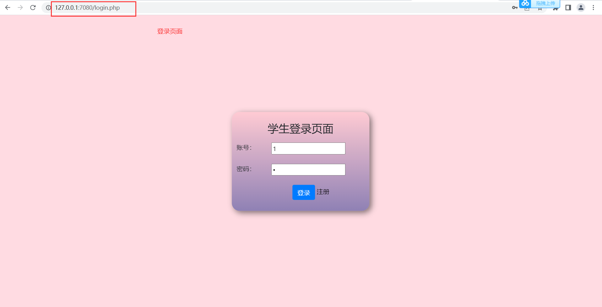
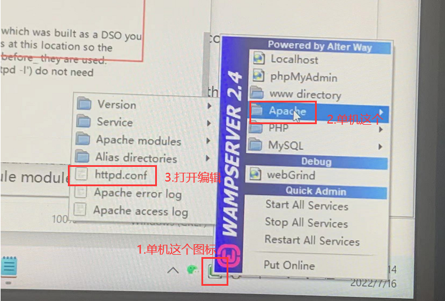
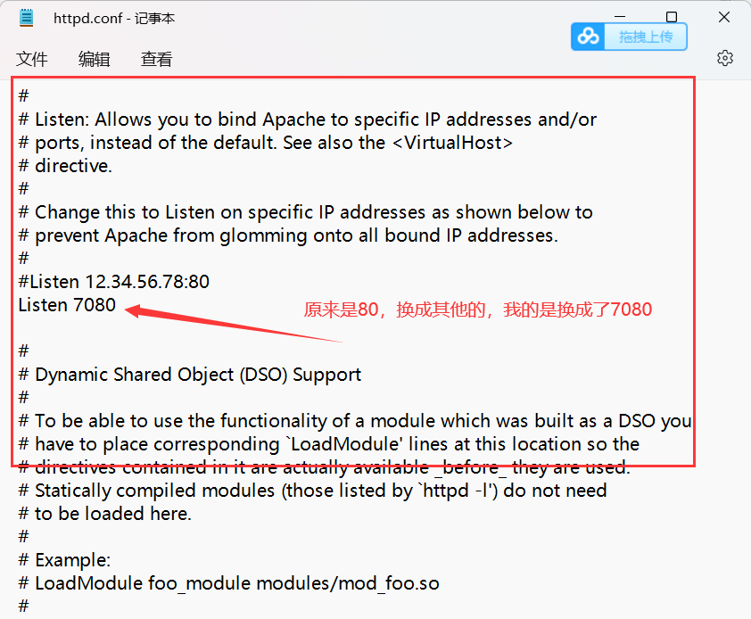
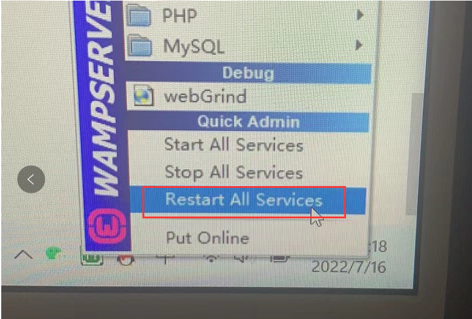
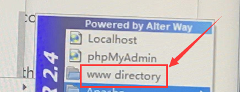
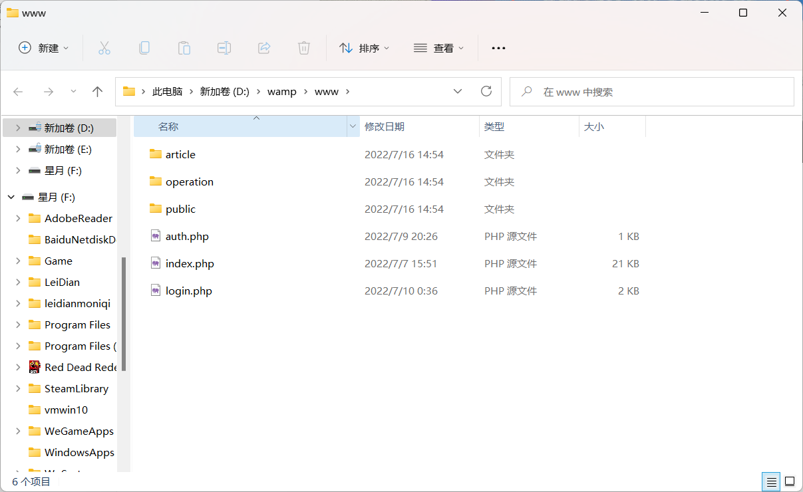

# php实现数据库的增删查改操作

php实现数据库的增删查改，以及翻页功能等等。

## 功能演示如下:

### 1.登录页面

### 2.登录成功后跳转到首页

### 3.学生列表

### 4.增加学生

### 5.删除学生

### 6.修改信息

## 运行教程：

### 1.运行软件：WampServer

软件已放到百度网盘，32位和64位都放了，自行下载。（官网太卡，可能下载不了）

软件下载链接：https://pan.baidu.com/s/1Svrvv_Pyu2V3l1xnE8_9zA 
提取码：myjd

本人运行项目使用的64位软件，win11系统。

### 2.安装好WampServer以后，如果运行软件这个图标不是绿色 的话，

#### 那么可能是有以下两个原因：

##### 1.本机装了mysql或者sql等等，已经在运行，需要去电脑的搜索：（1）搜索服务：

##### （2）找到对应的mysql把服务停止（Apache的mysql和本机的mysql是两个独立的sql，如果本机的myslq服务没有关闭，这个就会没法运行！）：

##### 2.还有一种原因就是电脑默认的80端口已经被占用了，这个就需要去（php=>php.ini=>修改端口）

### 3.以上操作完了，重新启动，看看图标应该就变蓝色了。这时候就可以正常访问项目了。

### 4.这个时候就把项目的www下面的全部文件都拷贝到这个里面

### 

像这样：

### 5.然后就可以去导入数据库了，游览器输入http://127.0.0.1:7080/

作者：星月

wx：15237156071
